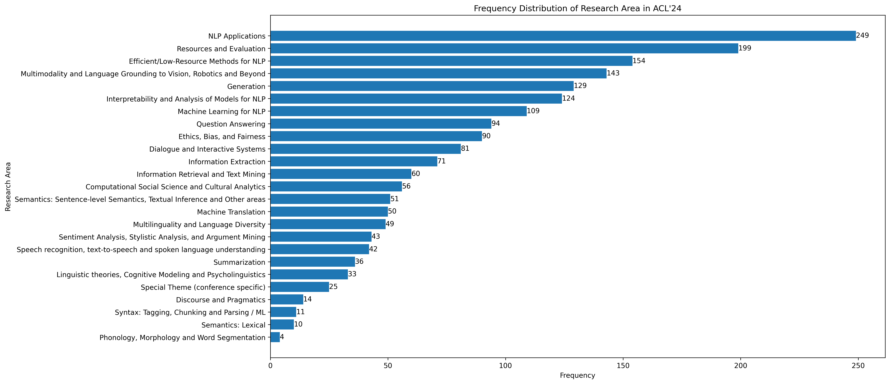
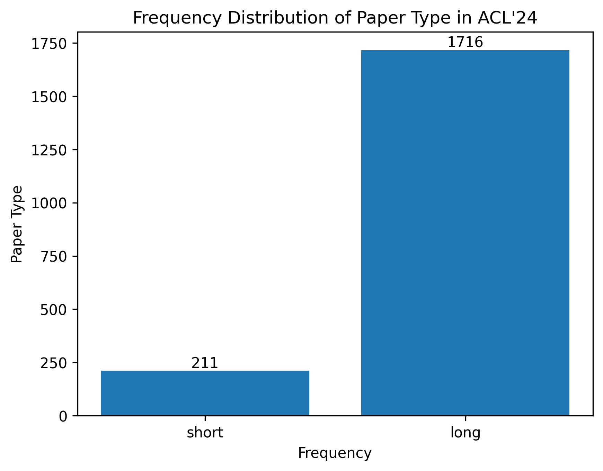

# ACL'24 Statistics

🚧 Work in progress

### Before we start

It's strange that the existing work on OpenReview Statistics is all about ICLR, and there are few for ACL. How can an NLP-related conference go without NLP analysis?

Be careful, since ACL submission has not yet finished, statistics in this repo may not be integrated.

The repo is (expected to be) updating.

### Overview

By 0306, there has been 1929 submissions in total (in morning). p.s. 1927 in afternoon (?)

#### Research Area

1927 in total.

#### Paper Type

1927 in total.

#### Wordcloud

1927 in total.

### History

- **@0306** In the AE Checklist stage. `1927` pieces of work have been revealed.

### TODOs

- [ ] Tutorial of this approach.

### Ackonwledgements

Thanks to other conference statistics works.

It's cool that OpenReview has public API. But sadly, its star count is less than two repos about ICLR statistics combined :(

- Data
    - [ACL Rolling Review - February 2024](https://openreview.net/group?id=aclweb.org/ACL/ARR/2024/February)
- Code
    - [OpenReview API](https://docs.openreview.net/getting-started/using-the-api)
    - [OpenReview API Repo on GitHub](https://github.com/openreview/openreview-py)
    - [OpenReview Python Client Documentation](https://openreview-py.readthedocs.io/en/latest/)
- Figures
    - [Crawl and Visualize ICLR 2023 OpenReview Data](https://github.com/fedebotu/ICLR2023-OpenReviewData): It's a pity that ICLR analysis work doesn't use official APIs (maybe any efficiency considerations?).
    - [ICLR2022 Statistics](https://github.com/weigq/iclr2022_stats/tree/master): Industry-style code is great, but the method of crawling URLs seems not to be revealed.

Should you have any questions or suggestions, feel free to open a new issue or pull request!